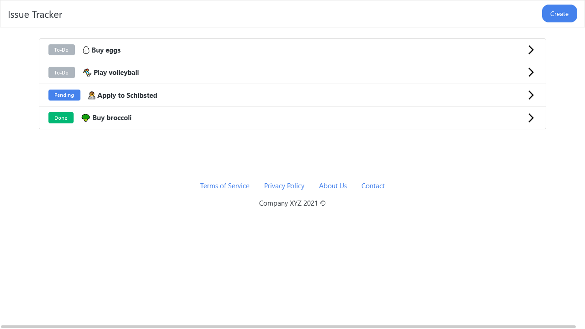
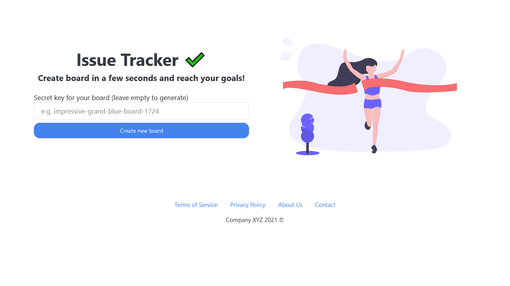
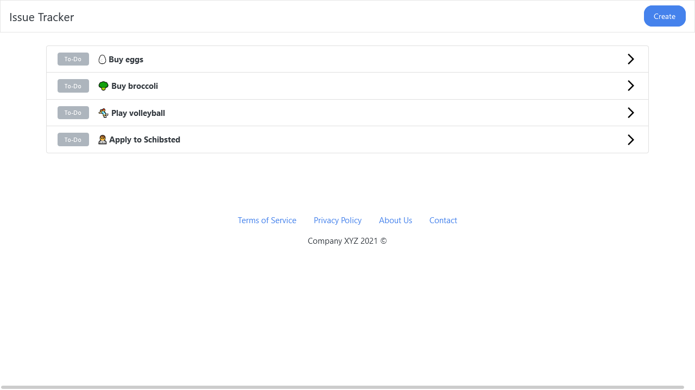
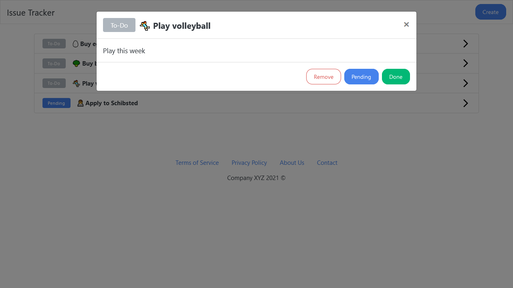
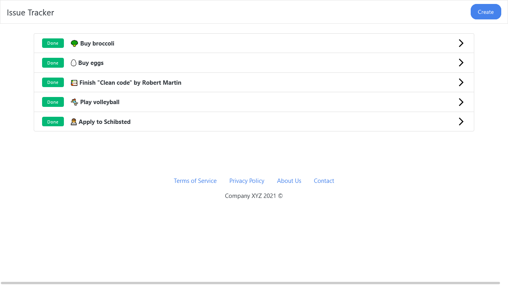
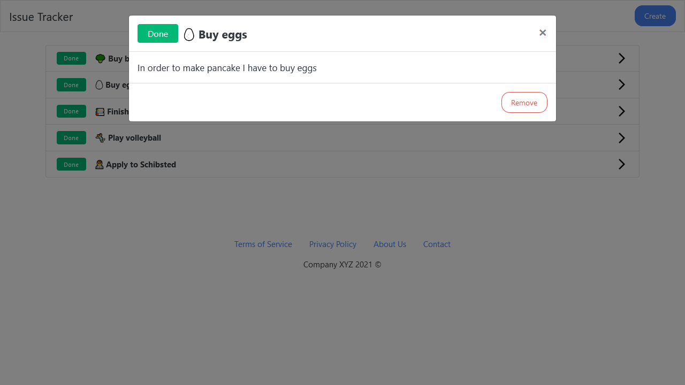

# issue-tracker
Simple issue tracker, repo for both frontend and backend.





### Getting started

To configure and run this project, follow instruction below:
```shell
# clone repo
git clone https://github.com/pilotpirxie/issue-tracker.git

# open client
cd issue-tracker/client

# install client deps
yarn

# yarn start for development
yarn start

# to build and generate static files
yarn build

# to run server, open server directory
cd issue-tracker/server

# install server deps
yarn

# run server with nodemon
yarn dev

# or directly with node/pm2 with
yarn start
```

### Setup database
To setup database connection run server with the following environment variables:
```shell
# database name, default "issue_tracker"
DB_NAME

# username, default "postgres"
DB_USER

# password, default "mysecretpassword"
DB_NAME

# host, default "localhost"
DB_HOST

# port, default "5432"
DB_HOST
```
or open ``server/config/sequelize.js`` to change values directly. 
Sequelize will synchronize database schema at first run, however
you can use ``migration/schema.sql`` to manually setup database.

### Tests
To run client tests with ``jest`` and ``react-testing-library``:
```shell
yarn test

# output should be similar to
 PASS  src/components/IssueDetailsModal/IssueDetailsModal.test.js
 PASS  src/containers/App/App.test.js
 PASS  src/containers/Board/Board.test.js
 PASS  src/components/IssueList/IssueListItem.test.js
 PASS  src/containers/HomePage/HomePage.test.js
 PASS  src/containers/NewIssue/NewIssue.test.js
 PASS  src/components/HeroImage/HeroImage.test.js
 PASS  src/components/IssueList/IssueList.test.js
 PASS  src/components/NewIssueModal/NewIssueModal.test.js
 PASS  src/components/Layout/Layout.test.js
 PASS  src/components/NewBoardForm/NewBoardForm.test.js
 PASS  src/components/Footer/Footer.test.js
 PASS  src/components/Alert/Alert.test.js
 PASS  src/containers/IssueDetails/IssueDetails.test.js
 PASS  src/components/Navbar/Navbar.test.js
A worker process has failed to exit gracefully and has been force exited. This is likely caused by tests leaking due to improper teardown. Try running
with --detectOpenHandles to find leaks.

Test Suites: 15 passed, 15 total
Tests:       32 passed, 32 total
Snapshots:   0 total
Time:        8.084 s
```

Server tests with ``jest`` and ``supertest``:
```shell
yarn test

# Output should be similar to
Test Suites: 2 passed, 2 total
Tests:       10 passed, 10 total
Snapshots:   0 total
Time:        5.07 s
Ran all test suites.
Done in 6.44s.
```

In the ``postman/`` directory there is a request api collection. You can import it to Postman or Insomnia.

### Prerequisites

* PostgreSQL
* Node > 12
* Yarn

### Screenshots











